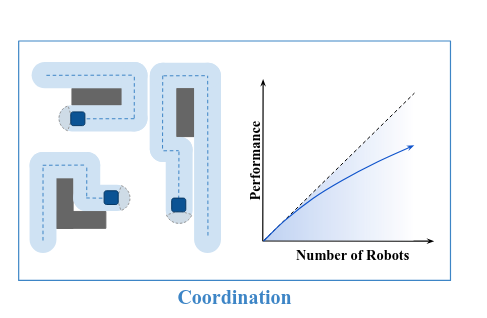
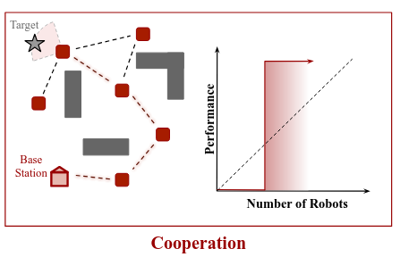
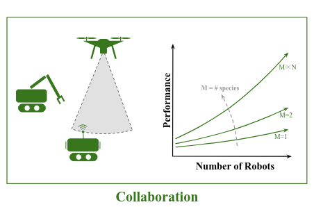
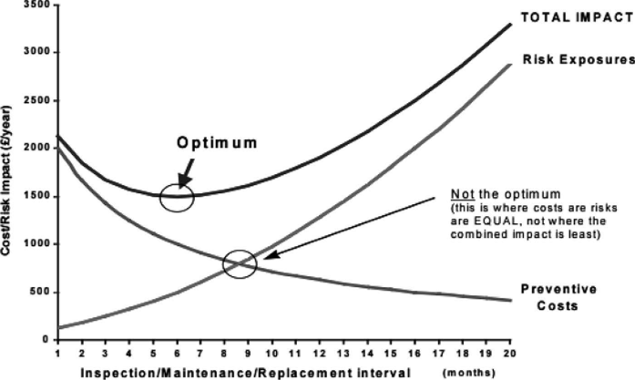
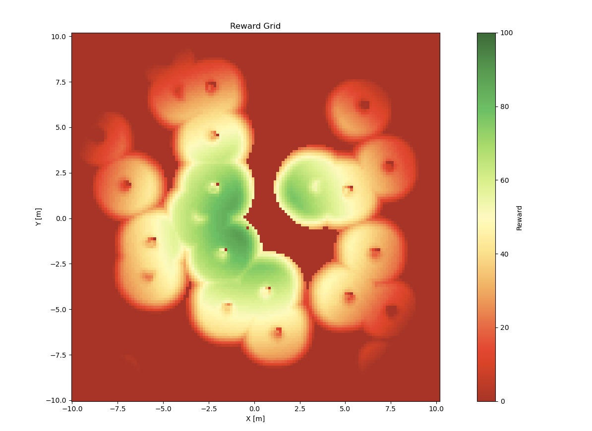
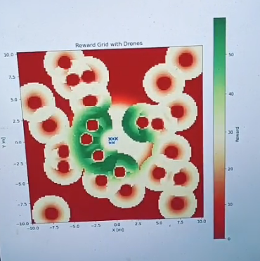

#+title: Multi Robot

* Understanding Taxanomy
** The 3C's of Multi Robot operations
*** Coordination
Ratio of Performance with the number of robots
*** Cooperation
Increase in capabilities of the system with the increase in the number of robots
*** Collaboration
Ratio of performance to the number of species of robots

* Coordination
Ratio of Performance with the number of robots

* Cooperation
Increase in capabilities of the system with the increase in the number of robots

* Collaboration
Ratio of performance to the number of species of robots

* Planning and Task Assingment
*** Assignment
Assigning each bot its domain or area of operation such that it minimizes or maximizes a global condition such as (cost or time).
*** Routing
It optimizes sequences of stops the bot will take to optimize a global parameter
*** Path-Planning
It does obstacle avoidance on the map to find the optimal path for the bot.
* Adaptability (Our Primary Goal interest)
As an optimization goal, regularly distribute and reassign objectives among
robots through replanning. This replanning should be based on actual resource consump-
tion to optimize objective completion as execution conditions evolve.

* Replan Horizon
Replanning operations although necessary for maximum efficenecy in unvfavourable environments they are expensive and their frequency needs to be tuned to get the maximum result otherwise their gains would be offset by their costs
This is also a common observantion that also happens in organizations

* Calculating Resilience
** Increasing Distance
It was measured that increasing distance increased the probability of ressilience drops
** Implication
Any solution that tries to make a resiliant system must try to minimize the communication distance between bots and keep it as the part of its optimization problem
* Solution provided by the Paper
1. It gives a probabilistic score of the system resiliency which is then fed in to a binary decision tree as one of the other paramters before moving the robot
2. It does so by calculating (r,s) score in which r is the number of robots in the direct communication range in a network meanwhile s is the number of well informed robots in neighbouring threshold
3. It works by internal voting of the environment states between the robots which helps in offsetting a wrong measurement by a faulty robot

* Monte-Carlo Tree Search
1. Proposed a distributed solution where each robot builds its own plan and shares information regarding the
probability of its future actions with others.
2. This approach is more tolerant to faults in the ground control station, as the robots are independent.
3. However, it requires the robots to have enough processing power to build their plans and communicate with all other robots.
4. Moreover, if two robots are equally capable of pursuing an objective, there is no guarantee
that they will not compete to accomplish the same objective.

* My Experiment in multi robot planning
Initial implementation without Robot

* My Experiment for increasing resilience
Implementation with Robots

* Challenges Faced by me (Personal Experiences)
1. Multi Robot simulation requires significantly more computational power that becomes difficult to run weak systems like Laptops
2. The above point can be mitigated by *NOT* simulating all the robots but instead just simulate how the decision making would happen but this does not discount the fact that there would be computational challenges even on the deployment side as these robotics edge systems often are using low powered devices like raspberry pi (especially aerial systems which has to optimize every gram of weight)

* Conclusion
** There is no one size fits all solution.
Different domains requires different techniques.(For example) even in the case of fire rescue different algoritms and model might perform differently based on the floor size, population density, ease of movement.
** We need a tightly scoped problem
The problem should be very specific with fixed constraints and should not be general.
** Integration with global parameter optimization
As there generally is a global parameter optimization so multi robot ressilience becomes a part of the bigger picture which cannot be solved individually
* References
1. https://arxiv.org/abs/2109.12343
2. https://ieeexplore.ieee.org/abstract/document/9357930/
3. [[https://telecom-paris.hal.science/hal-05220290v1/document]]
4. https://journals.sagepub.com/doi/epub/10.1177/0037549720964548
